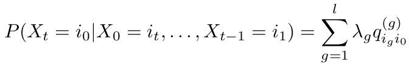
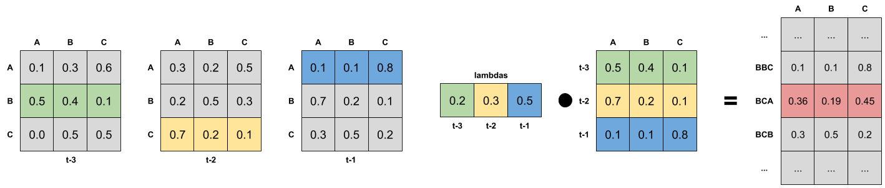

# mtd-learn: Package for training Mixture Transition Distribution (MTD) models

## MTD models






## Installation

```
pip install mtdlearn
```

## Usage examples

Foe usage examples please refer to [examples](https://github.com/PiotrekGa/mtd-learn/tree/master/examples) section.

## Communication
GitHub [Issues](https://github.com/PiotrekGa/mtd-learn/issues) for bug reports, feature requests and questions.

## Contribution
Any contribution is welcome! Please follow this [branching model](https://nvie.com/posts/a-successful-git-branching-model/).

## License
MIT License (see [LICENSE](https://github.com/PiotrekGa/mtd-learn/blob/master/LICENSE)).

## References
1. Introduction to MTD model [The Mixture Transition Distribution Model for High-Order Markov Chains and Non-Gaussian Time Series](https://projecteuclid.org/euclid.ss/1042727943) by André Berchtold and Adrian Raftery
2. Paper with estimation algorithm implemented in the package [An EM algorithm for estimation in the Mixture Transition Distribution model
](https://arxiv.org/abs/0803.0525) by Sophie Lèbre and Pierre-Yves Bourguinon.
