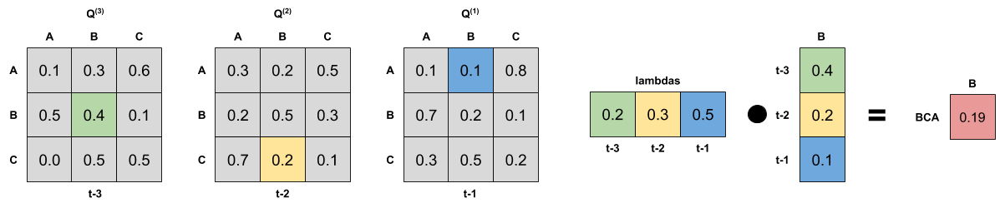

# mtd-learn: Package for training Generalized Mixture Transition Distribution (MTDg) models

## Installation

```
pip install mtdlearn
```

## MTDg model

The Generalized Mixture Transition Distribution (MTDg) model was proposed in 1985 by Raftery<sup>[1]</sup>. It aimed 
to approximate higher order Markov Chains, but can be used as a standalone model.

### Definition


Where _lambdas_ are lag parameters and Q<sub>g</sub> = [q<sub>i<sub>g</sub></sub><sub>i<sub>0</sub></sub><sup>(g)</sup>]
is a _m_ x _m_ transition matrix representing relationship between _g_ lag and the present state.

To parameters have to meet following constraints to produce probabilities:


The model can be easier understood as weighted probabilities (by _lambdas_) of Q<sub>g</sub> matrices. The example below
shows how to calculate a probability of transition B->C->A->B from an order 3 MTD model:



### Number of independent parameters

The number independent parameters of the MTDg model equals _(ml - m + 1)(l - 1)_ and for Markov Chain 
_m<sup>l</sup>(m-1)_. You can find a comparison of the number of parameters below.

| States   |      Order    | Markov Chain | MTDg<sup>[1]</sup>  |
|----------|:-------------:|-------------:|--------------------:|
| 2        | 1             |     2        | 2                   |
| 2        | 2             |     4        | 3                   |
| 2        | 3             |     8        | 4                   |
| 2        | 4             |    16        | 5                   |
| 3        | 1             |     6        | 6                   |
| 3        | 2             |    18        | 10                  |
| 3        | 3             |    54        | 14                  |
| 3        | 4             |   162        | 18                  |
| 5        | 1             |    20        | 20                  |
| 5        | 2             |   100        | 36                  |
| 5        | 3             |   500        | 52                  |
| 5        | 4             |  2500        | 68                  |
| 10       | 1             |    90        | 90                  |
| 10       | 2             |   900        | 171                 |
| 10       | 3             |  9000        | 252                 |
| 10       | 4             | 90000        | 333                 |


## Usage examples

For usage examples please refer to [examples](https://github.com/PiotrekGa/mtd-learn/tree/master/examples) section.

## Communication
GitHub [Issues](https://github.com/PiotrekGa/mtd-learn/issues) for bug reports, feature requests and questions.

## Contribution
Any contribution is welcome! Please follow this [branching model](https://nvie.com/posts/a-successful-git-branching-model/).

## License
MIT License (see [LICENSE](https://github.com/PiotrekGa/mtd-learn/blob/master/LICENSE)).

## References
1. Introduction to MTDg model [The Mixture Transition Distribution Model for High-Order Markov Chains and Non-Gaussian Time Series](https://projecteuclid.org/euclid.ss/1042727943) by André Berchtold and Adrian Raftery
2. Paper with estimation algorithm implemented in the package [An EM algorithm for estimation in the Mixture Transition Distribution model
](https://arxiv.org/abs/0803.0525) by Sophie Lèbre and Pierre-Yves Bourguinon.
